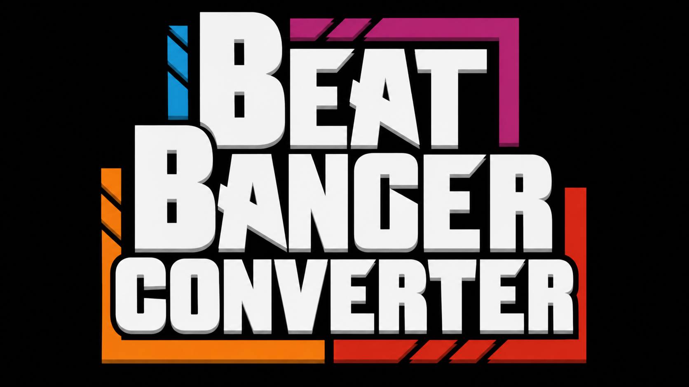

# Beat Banger Legacy → Release Converter



A conversion tool for bringing Legacy Beat Banger mods into the Release mod layout used by the game.

This project reads a Legacy `chart.cfg` and related assets, resolves the conversion rules, and writes a Release-ready directory structure with notes, animations, effects, metadata, audio, backgrounds, and validation diagnostics.

The current entry point is the repository-root `main.py`, which delegates to the conversion pipeline under `src/` and can also launch the PySide6 mod library GUI.

## What the converter does

The pipeline is designed to preserve the legacy timing and structure as closely as possible while generating a mod in the Release format expected by the game.

It handles:

- note data and state transitions
- animations and keyframes
- sprite-sheet effects and effect overrides
- background conversion and scaling
- sound loops and one-shot audio events
- voice-bank resolution and asset validation
- Release metadata, scenario config, and output organization
- debug summaries, warnings, and error reporting for each conversion

The tool also supports a library workflow where a folder containing multiple Legacy mods can be scanned and converted one by one from a GUI.

## Project structure

```text
BBConverter/
├── README.md
├── main.py
├── chart.cfg
├── effect_overrides.json
├── sheet_overrides.json
├── config/
│   ├── chart.cfg
│   ├── effect_overrides.json
│   └── sheet_overrides.json
├── src/
│   ├── __init__.py
│   ├── animation_converter.py
│   ├── asset_resolver.py
│   ├── background_converter.py
│   ├── background_scaler.py
│   ├── comparator.py
│   ├── convert_mod.py
│   ├── converter.py
│   ├── debug.py
│   ├── effect_converter.py
│   ├── generate_examples.py
│   ├── legacy_parser.py
│   ├── mod_library.py
│   ├── models.py
│   ├── note_generator.py
│   ├── pyside_app.py
│   ├── release_writer.py
│   ├── sound_fx_converter.py
│   ├── sound_loop_converter.py
│   ├── timeline.py
│   ├── tkinter_app.py
│   ├── validate_against_ground_truth.py
│   └── voice_bank_converter.py
├── tests/
│   ├── conftest.py
│   ├── run_converters_test.py
│   ├── test_animation_converter.py
│   ├── test_asset_checks.py
│   ├── test_background_scaler.py
│   ├── test_full_conversion.py
│   ├── test_mod_library.py
│   ├── test_pyside_gui.py
│   ├── test_regressions.py
│   └── test_tkinter_gui.py
├── tools/
│   ├── batch_convert.py
│   └── generate_sheet_overrides.py
├── build/
├── .venv/
├── .pytest_cache/
└── __pycache__/
```

## Requirements

- Python 3.10+
- PySide6 for the GUI and library interface
- Pillow for sprite-sheet inspection and thumbnail generation
- pytest for automated validation

Install dependencies:

```bash
python -m pip install PySide6 Pillow pytest
```

## Quick start

The input must be a Legacy mod directory containing a `chart.cfg`. `meta.cfg` is optional and may help with metadata, but not all Legacy mods require it.

### Convert a single mod from the CLI

```bash
python main.py /path/to/legacy_mod /path/to/output
```

If the output path is omitted, the tool writes a sibling folder with the `_Release` suffix.

```bash
python main.py /path/to/legacy_mod
```

### Use a separate assets directory

```bash
python main.py \
  /path/to/legacy_mod \
  /path/to/output \
  --assets-dir /path/to/assets
```

### Skip copying referenced assets

```bash
python main.py \
  /path/to/legacy_mod \
  /path/to/output \
  --no-copy-assets
```

### Skip interactive effect-sheet prompts

```bash
python main.py \
  /path/to/legacy_mod \
  /path/to/output \
  --no-interactive
```

### Omit the final `last_transition`

```bash
python main.py \
  /path/to/legacy_mod \
  /path/to/output \
  --no-last-transition
```

### Customize the generated scenario folder name

```bash
python main.py \
  /path/to/legacy_mod \
  /path/to/output \
  --scenario-name "Girl Brat"
```

### Launch the GUI/mod library

```bash
python main.py --gui
```

## Command-line options

The CLI is exposed by `main.py` and supports the following flow:

```bash
python main.py [--gui] [input_mod] [output_mod] [options]
```

Available options:

- `--gui`: open the PySide6 mod library interface instead of running a one-off conversion
- `input_mod`: Legacy mod folder to read
- `output_mod`: destination Release folder; defaults to `<input_mod>_Release`
- `--assets-dir`: directory containing the Legacy assets; defaults to the mod folder itself
- `--no-copy-assets`: do not copy referenced assets into the output
- `--no-interactive`: skip prompts for unknown effect sprite-sheet layouts
- `--no-last-transition`: omit the final `last_transition` state
- `--scenario-name`: set the scenario folder name in the generated Release output

## GUI and mod library

The repository includes a PySide6 interface that acts as a small mod library and conversion dashboard.

The GUI can:

- select a library folder containing multiple Legacy mods
- discover direct child mods automatically
- persist the library path in user settings
- show mod cards with thumbnails and metadata
- convert individual mods from the library list
- refresh the library while keeping the interface responsive
- run conversions off the UI thread with background processing
- override assets directory and scenario name per conversion
- toggle asset-copy behavior, interactive sheet prompts, and final-transition inclusion

The project stores library settings in:

```text
~/.config/BeatBangerConverter7/settings.json
```

or, when `XDG_CONFIG_HOME` is defined:

```text
$XDG_CONFIG_HOME/BeatBangerConverter7/settings.json
```

## Built-in debug and diagnostics

Each conversion generates a debug log with the output name pattern:

```text
<output>_conversion_debug.txt
```

The debug log includes details such as:

- BPM and offset values
- note/timeline data and last-beat calculations
- counts of notes and state changes
- collision or spawn-state warnings
- generated effects and loops
- copied vs. missing assets
- voice-bank resolution details
- conversion summary and issue lists

The GUI debugger panel exposes:

- an activity log with timestamped events
- a session history of conversion runs with pass/warn/fail badges
- a summary view with structured counts for notes, animations, effects, warnings, and errors
- dedicated warning/error tabs
- a raw debug log viewer with monospaced output and simple search navigation

## Timing model

The project uses a shared timeline across notes, animations, effects, audio, backgrounds, and voice banks.

The conversion follows the same frame-to-time logic throughout the pipeline:

```python
seconds_per_frame = 30 / BPM
timestamp = frame * seconds_per_frame - note_offset
```

Negative timestamps are clamped to `0.0` and logged as warnings when needed. The generated `settings.cfg` intentionally keeps `song_offset` at `0.0` to avoid double-applying the Legacy offset.

## Output structure

The converter writes a Release-like folder structure expected by the game and flattens assets into the matching `images/` and `audio/` directories.

A generated mod typically contains the scenario folder, config files, and flattened asset folders required by the build. The exact naming of the output directory depends on the chosen destination path and optional scenario override.

## Default configuration and overrides

The project includes default config files under `config/` and also supports override files such as:

- `chart.cfg`
- `effect_overrides.json`
- `sheet_overrides.json`

These defaults are used when the app runs in packaged or dev mode, and can be refreshed automatically when the app creates the config directory on first use.

## Running tests

The project includes a pytest suite covering converters, assets, full conversion flows, GUI behavior, and regression checks.

Run the full suite:

```bash
pytest -q
```

Or run the repository helper script:

```bash
python tests/run_converters_test.py
```

## Development workflow

When extending support for a Legacy property:

1. compare it against a real mod and the corresponding Release format
2. update the relevant parser or converter layer
3. add or update a regression test
4. run the focused validation suite
5. validate the output on a real sample mod when possible

## Building a standalone executable

The project can be packaged with Nuitka for standalone execution.

Linux example:

```bash
python -m venv .venv
source .venv/bin/activate
python -m pip install -U "Nuitka[app]" Pillow
python -m nuitka --mode=standalone --follow-imports --include-package=PIL --output-dir=build main.py
```

Windows example:

```powershell
py -m venv .venv
.\.venv\Scripts\Activate.ps1
python -m pip install -U "Nuitka[app]" Pillow
python -m nuitka --mode=standalone --follow-imports --include-package=PIL --output-dir=build main.py
```

## Known limitations

Some Release values cannot be reconstructed exactly from Legacy data alone. When that happens, the converter prefers to preserve the uncertainty in the diagnostic output rather than invent unsupported values.

## License

See the repository for the applicable license information.
